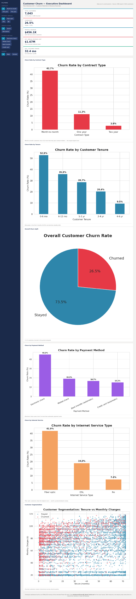

## 📊 Customer Churn Analysis & Business Intelligence Dashboard


An end-to-end customer churn analysis project using Python, SQL, and Power BI to transform raw telecom data into actionable business insights and an executive dashboard.

## 📖 Project Overview

A telecom company is losing customers at a rate that's eating into recurring
revenue. This project answers three questions a real business stakeholder
would ask:

1. **How bad is it, in dollar terms?**
2. **Who is churning, and why?**
3. **What should we actually do about it?**

The project follows a full Business Analyst workflow:
business problem → requirements → data understanding → cleaning → analysis → SQL validation → dashboard design → recommendations — rather than a standalone EDA notebook.


## 🎯 Business Problem

> A telecom company has observed increasing customer churn, affecting revenue
> and profitability. The objective is to identify factors contributing to
> churn and recommend actionable business strategies to improve customer
> retention.


## 🧠 Tech Stack

- **Programming:** Python
- **Libraries:** Pandas, NumPy, Matplotlib, Seaborn
- **Database:** SQL, SQLite
- **Dashboard:** Power BI
- **Machine Learning:** scikit-learn (Logistic Regression)
- **Dataset:** IBM Telco Customer Churn Dataset (Kaggle)

## 📸 Dashboard Preview



Interactive prototype: [`dashboard/executive_dashboard_prototype.html`](dashboard/executive_dashboard_prototype.html)

## 📌 Features

- **Documented data cleaning** — duplicate checks, datatype correction,
  missing-value handling, outlier flagging, feature engineering (tenure
  cohorts), all logged and explained.
- **11 EDA visualizations** covering contract type, tenure, pricing, payment
  method, internet service, senior citizen status, gender, correlation, and
  customer segmentation.
- **11 business KPIs** — churn rate, revenue at risk, CLV estimate, high-risk
  customer %, and more — calculated directly from the cleaned dataset.
- **10 SQL business queries** against a SQLite database, independently
  validating the Python findings (see [`sql/query_results.md`](sql/query_results.md)).
- **Executive dashboard** — designed with KPI cards, filters, and six
  supporting visuals; prototyped in HTML/CSS with a full Power BI rebuild
  guide (DAX measures + layout) included.
- **Optional baseline churn-prediction model** (Logistic Regression, ~78.5%
accuracy) — kept intentionally lightweight since the project's focus is
  business analysis and stakeholder reporting, not predictive modeling.


## 📂 Dataset

- **Source:**  IBM Telco Customer Churn Dataset (Kaggle)
- **Records:** 7,043 customers
- **Features:** 21 customer attributes 
- **Target Variable:** Churn


## 📈 Key KPIs

| KPI | Value |
|---|---|
| Total Customers | 7,043 |
| Churn Rate | 26.5% |
| Estimated Annual Revenue Lost to Churn | $1,669,570 |
| Customer Lifetime Value (Estimate) | $2,096 |
| High-Risk Customer Percentage | 28.3% |


## 🔍 Key Business Insights

- **Contract type is the strongest churn driver**: month-to-month customers
  churn at 42.7% vs. 2.8% for two-year contracts — a 15x gap.
- **Churn peaks in the first 6 months** (52.9%) and declines steadily as
  tenure increases — onboarding is the highest-leverage intervention window.
- **The riskiest segment**: month-to-month + fiber optic customers churn at
  54.6% (confirmed independently via SQL cross-tab).
- **Payment method matters**: electronic check users churn at 45.3%, roughly
  3x the rate of customers on automatic payment methods.
- **Senior citizens churn nearly 2x** the non-senior rate while paying higher
  average bills — a clear, quantifiable retention opportunity.
- Price alone does not explain churn — monthly charge distributions overlap
  substantially between churned and retained customers.


## 🚀 How to Run

```bash
# 1. Install dependencies
pip install -r requirements.txt

# 2. Run the analysis pipeline (cleans data, calculates KPIs, generates charts)
cd notebooks
python churn_analysis.py

# 3. Load results into SQLite and run the business queries
cd ../sql
python run_queries.py

# 4. Open the dashboard prototype
open ../dashboard/executive_dashboard_prototype.html
```


## 🔮 Future Enhancements

- Connect the dashboard to a live CRM data source instead of a static CSV snapshot.
- Automate the pipeline on a schedule (e.g., dbt or a cron job) for ongoing monitoring.
- Expand the predictive model beyond logistic regression (e.g., gradient boosting) and add a churn-risk score directly into the dashboard.
- A/B test the top recommendation (contract-upgrade incentive) before full rollout.
- Add row-level security in Power BI so different stakeholder groups see only relevant segments.


## 👩‍💻 Author

Developed as a Business Analyst / Data Analyst portfolio project, demonstrating
requirement analysis, SQL, Python-based data analysis, dashboard design, and
stakeholder-facing business communication.